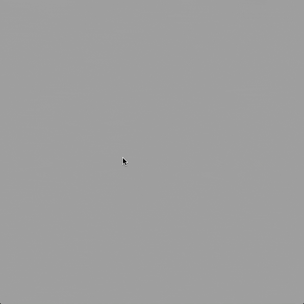
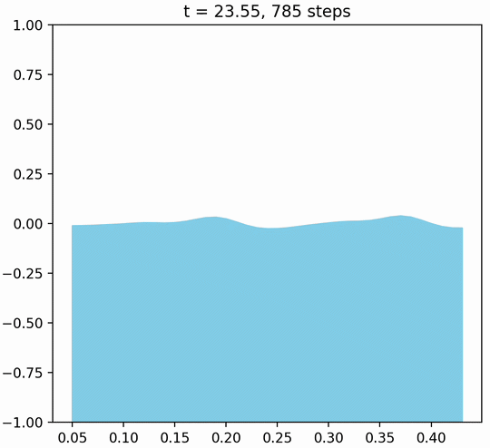

# Interactive Simulations of Dispersive Water Waves




Small interactive experiments for dispersive water waves in one and two dimensions.

## Run

Install the dependencies, then run a simulation from `src/` (the 2D program loads
`env.hdr` from that directory):

```bash
python -m pip install -r requirements.txt
cd src
python move_phase_1d.py
python move_phase_2d.py
```

`move_phase_1d.py` opens a Matplotlib animation. `move_phase_2d.py` opens a
Pygame window; click or drag to add waves, and press `R` to reset it.

## FFT phase propagation

`move_phase_[1d/2d].py` are the recommended, fast simulations. Each frame,
they use an FFT to decompose the surface into frequency components, advance each
component's phase according to its wavelength-dependent wave speed, and transform
back to the spatial domain. This directly produces dispersion without numerically
integrating the wave equation.

The 2D version uses a reflection trick built on FFT periodicity: it doubles the
simulation domain, then folds the right and bottom halves back over the visible
domain. The folded copies act as reflected waves at the boundaries.

## Older wave-equation experiments

`wave_equation_[1d/2d].py` are earlier, much slower implementations. They
numerically integrate the wave equation while using FFTs to separate frequency
components and apply a wave speed that varies with wavelength. They are kept as
reference experiments rather than the preferred way to run the simulation:

```bash
cd src
python wave_equation_1d.py
python wave_equation_2d.py
```
